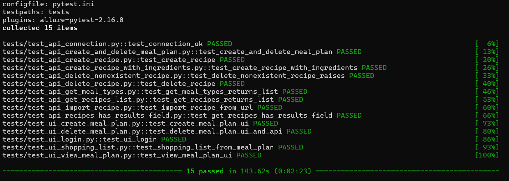
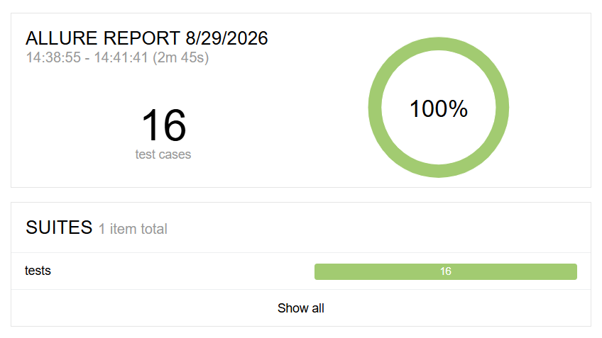

# Дипломный проект: Smoke-тестирование раздела Meal Plan веб-приложения Tandoor

## Выполнил: Максим Кожевников

Автоматизированные smoke-тесты ключевых сценариев раздела **Meal Plan**
приложения [Tandoor](https://tandoor.vs1.srv.eduson.tv/).

**Цель:** убедиться, что основные пользовательские сценарии планирования питания
работают: вход в аккаунт, создание/просмотр/удаление Meal Plan и автоматическое
формирование списка покупок — как на уровне веб-интерфейса, так и через API.

**Стек:** Python, Selenium WebDriver, requests, pytest, allure-pytest, GitHub Actions, Allure Report.

> Согласно заданию CI/CD планировался на GitLab, но регистрация на
> `gitlab.com` невозможна из-за гео-ограничений (не проходит верификация
> аккаунта из РФ). Поэтому CI/CD реализован через **GitHub Actions**
> с публикацией Allure-отчёта на GitHub Pages.

---

## 1. Запуск локально

### Требования
- Python 3.11+;
- Google Chrome;
- Git.

### Установка
```bash
# 1. Скачайте репозиторий и перейдите в него
git clone https://github.com/Maksim504/QA_FinalProject_Kozhevnikov.git
cd QA_FinalProject_Kozhevnikov

# 2. Создайте виртуальное окружение
python -m venv venv
# Windows
venv\Scripts\activate
# Linux/Mac
source venv/bin/activate

# 3. Установите зависимости и настройте окружение
pip install -r requirements.txt
cp .env.example .env   # заполните реальными значениями
```

### Запуск тестов
```bash
# все тесты
pytest -v

# только API-тесты
pytest -m api -v

# только UI-тесты
pytest -m ui -v

# с генерацией Allure-ерзультатов
pytest --alluredir=allure-results

# открыть Allure-отчёт
allure serve allure-results
```

> `allure` — это отдельная программа (CLI). В командах выше она используется
> только для просмотра отчёта: сначала `pytest`
> с флагом `--alluredir=allure-results` сохраняет результаты, затем
> `allure serve` открывает их в браузере.

### Установка Allure (локально)

Требуется **Java 8+** (Allure запускается на Java). На Windows удобнее всего
поставить Allure через **Scoop** (менеджер пакетов, работает без прав
администратора). Команды выполняются в **PowerShell** (в cmd их нет):

```powershell
Set-ExecutionPolicy -ExecutionPolicy RemoteSigned -Scope CurrentUser
irm get.scoop.sh | iex
scoop bucket add extras
scoop install allure
```

Allure откроется в том же терминале из папки проекта:

```powershell
pytest --alluredir=allure-results
allure serve allure-results
```

Альтернатива (без Scoop): скачайте `allure-2.29.0.zip` с
[GitHub Releases](https://github.com/allure-framework/allure2/releases/tag/2.29.0),
распакуйте и вызывайте через полный путь
`allure-2.29.0\bin\allure.bat serve allure-results` (не забудьте про Java).

### Запуск в CI/CD (GitHub Actions)
Workflow описан в `.github/workflows/ci.yml`: **API-тесты → UI-тесты**
(головной Selenium на `selenium/standalone-chrome`) → генерация
Allure-отчёта → публикация на **GitHub Pages**. Запускается
автоматически на каждый push в ветку `main`; повторный запуск —
кнопкой **Run workflow** на вкладке Actions → CI.

UI-джоба стартует только после успешного завершения API-джобы
(`needs: api-tests`): сервер нестабилен, и последовательный запуск
снижает одновременную нагрузку. Allure-отчёт собирается даже при
падении тестов — по нему видно, какой тест и почему упал.

Секреты для CI задаются в **Settings → Secrets and variables → Actions**
(те же переменные, что в `.env`): `BASE_URL`, `TANDOOR_TOKEN`,
`TANDOOR_USERNAME`, `TANDOOR_PASSWORD`. Для публикации отчёта
в **Settings → Pages** источник должен быть **GitHub Actions**.

---

## 2. Переменные окружения

| Переменная | Описание |
|---|---|
| `BASE_URL` | адрес приложения `https://tandoor.vs1.srv.eduson.tv` |
| `TANDOOR_TOKEN` | API-токен (Bearer) для запросов к REST API |
| `TANDOOR_USERNAME` | e-mail аккаунта Tandoor |
| `TANDOOR_PASSWORD` | пароль аккаунта Tandoor |
| `TANDOOR_UI_USERNAME` | имя пользователя для входа через веб-форму |

Пример `.env`:
```
BASE_URL=https://tandoor.vs1.srv.eduson.tv
TANDOOR_TOKEN=your_token_here
TANDOOR_USERNAME=your_email_here
TANDOOR_PASSWORD=your_password_here
TANDOOR_UI_USERNAME=Максим
```

> `.env` обязательно добавить в `.gitignore`.

---

## 3. Получение API-токена

1. Авторизуйтесь в приложении Tandoor.
2. Перейдите в **Настройки → API**.
3. Создайте новый токен (права **read write**).
4. Скопируйте токен в переменную `TANDOOR_TOKEN`.

---

## 4. Структура проекта

```
QA_FinalProject/
├── api/
│   └── client.py              # TandoorAPIClient: HTTP-запросы к REST API
├── pages/                     # Page Object Model
│   ├── base_page.py           # базовые методы (открыть URL, найти, кликнуть, заполнить)
│   ├── header_component.py    # верхняя панель навигации, проверка авторизации
│   ├── login_page.py          # страница входа
│   ├── welcome_page.py        # мастер приветствия после первого входа
│   ├── meal_plan_page.py      # календарь Meal Plan
│   ├── meal_plan_dialog.py    # форма создания/редактирования/удаления плана
│   └── shopping_list_page.py  # список покупок
├── tests/
│   ├── helpers.py                # общие помощники (уникальные имена/заголовки)
│   ├── test_api_connection.py    # API: соединение с сервером
│   ├── test_api_recipes_has_results_field.py  # API: поле results в списке рецептов
│   ├── test_api_get_recipes_list.py           # API: получение списка рецептов
│   ├── test_api_get_meal_types.py             # API: список типов питания
│   ├── test_api_create_recipe.py              # API: создание рецепта
│   ├── test_api_delete_recipe.py              # API: удаление рецепта
│   ├── test_api_create_recipe_with_ingredients.py  # API: рецепт с ингредиентами
│   ├── test_api_delete_nonexistent_recipe.py  # API: ошибка при удалении несуществующего
│   ├── test_api_import_recipe.py              # API: импорт по ссылке
│   ├── test_api_create_and_delete_meal_plan.py # API: создание/удаление плана
│   ├── test_ui_login.py                       # UI: вход в приложение
│   ├── test_ui_create_meal_plan.py            # UI: создание плана + проверка через API
│   ├── test_ui_view_meal_plan.py              # UI: просмотр плана на календаре
│   ├── test_ui_delete_meal_plan.py            # UI: удаление плана + проверка через API
│   └── test_ui_shopping_list.py               # UI: список покупок из плана
├── utils/
│   └── generate_test_data.py  # импорт рецептов, подготовка данных плана, очистка
├── data/
│   ├── recipes.json           # тестовые ссылки на рецепты
│   └── cookies.json           # cookie сессии (в .gitignore)
├── screenshots/               # скриншоты результатов тестирования (для README)
├── conftest.py                # фикстуры: api_client, driver, authorized_driver, очистка
├── pytest.ini                 # конфигурация pytest и маркеры ui/api
├── .github/workflows/ci.yml   # CI/CD на GitHub Actions + публикация Allure на GitHub Pages
├── .env.example               # пример переменных окружения
└── requirements.txt           # зависимости
```

---

## 5. Реализованные сценарии

**API (маркер `api`):** каждый тест вынесен в отдельный файл `tests/test_api_*.py`.
- `test_connection_ok` — соединение с API устанавливается;
- `test_get_recipes_has_results_field` — список рецептов содержит поле `results`;
- `test_get_recipes_returns_list` — список рецептов возвращается списком;
- `test_get_meal_types_returns_list` — получение списка типов питания;
- `test_create_recipe` — создание рецепта;
- `test_delete_recipe` — удаление рецепта → рецепт больше не возвращается;
- `test_create_recipe_with_ingredients` — создание рецепта с ингредиентами и проверка данных;
- `test_delete_nonexistent_recipe_raises` — обработка ошибки при удалении несуществующего рецепта;
- `test_import_recipe_from_url` — импорт рецепта по ссылке из тестовых данных;
- `test_create_and_delete_meal_plan` — создание плана питания, получение по id, удаление.

**UI (маркер `ui`):** каждый тест вынесен в отдельный файл `tests/test_ui_*.py`.
- `test_ui_login` — вход в приложение через форму;
- `test_create_meal_plan_ui` — создание Meal Plan через UI (рецепт, тип блюда,
  порции, чекбокс «Добавить в лист покупок») + проверка создания через API;
- `test_view_meal_plan_ui` — просмотр Meal Plan на календаре + проверка через API по id;
- `test_delete_meal_plan_ui_and_api` — удаление Meal Plan через UI + проверка через
  API, что план удалён;
- `test_shopping_list_from_meal_plan` — автоматическое формирование списка покупок
  из Meal Plan: через UI (страница `/shopping`) и через API.

Тесты размечены шагами Allure (`@allure.step`, `with allure.step`);
при падении теста автоматически сохраняется скриншот в `screenshots/`.

---

## 6. Библиотеки

pytest, selenium, requests, allure-pytest, python-dotenv.

Полный список зафиксирован в `requirements.txt`.

---

## 7. Особенности приложения, найденные при тестировании

- Поле формы плана питания в вашей версии называется **«Заголовок»**,
  а не «Название», а кнопка сохранения — **«Создать»**: локаторы написаны
  под фактический интерфейс.
- Кнопка **«Удалить»** в форме открывает дополнительный диалог подтверждения
  («Вы уверены, что хотите удалить этот объект?») — удаление происходит
  только после второго клика.
- Сервер **нестабилен**: POST на вход и обычные запросы эпизодически отвечают
  ложным HTTP 403 (CSRF), в том числе в идентичных условиях. Поэтому вход и
  проверка CSRF выполняются с повторными попытками.
- Импорт рецепта по URL выполняется в два шага: парсинг ссылки
  (`/api/recipe-from-source/`) и последующее создание рецепта
  (`/api/recipe/`). Эндпоинт `/api/recipe-import/` требует поля `storage` и `name`.
- Список покупок не объединяет одинаковые ингредиенты автоматически;
  готовый лист `/api/shopping-list/` не формируется — позиции читаются
  из `/api/shopping-list-entry/`.
- Создание плана питания (`POST /api/meal-plan/`) тоже нестабильно: эпизодически
  возвращает 500 даже при корректных данных. Клиент делает до 5 попыток
  с нарастающей паузой (2, 4, 6, 8 сек), поэтому редкие 500 не роняют тест.
- Allure-отчёт собирается и публикуется даже при падении тестов.

---

## 8. Известные проблемы

1. **GitLab**: регистрация на `gitlab.com` невозможна из-за гео-ограничений
   (аккаунт не проходит верификацию из РФ). Использован **GitHub Actions**.
2. **UI-тесты в CI** выполняются в headless-режиме через контейнер
   `selenium/standalone-chrome`; локально те же тесты можно запускать с
   видимым окном браузера. Результаты — скриншоты, шаги Allure — идентичны.
3. **Сервер нестабилен**: запросы эпизодически получают ложный HTTP 403 (CSRF),
   поэтому вход и проверка сессии выполняются с повторными попытками
   (см. раздел «Особенности приложения»).

---

## 9. Рекомендации по улучшению покрытия

- Добавить тест редактирования Meal Plan (шаги и поля формы идентичны созданию,
  но проверяется обновление плана через PATCH).
- Проверять пограничные значения полей формы (пустое название, 0/отрицательное
  количество порций, длинная заметка).
- Расширить список тестовых ссылок, включая рецепты с большим числом
  ингредиентов, чтобы проверить группировку на вкладке «Супермаркеты».
- Добавить проверку автопланировщика (`Автопланировщик` на странице планирования).
- Параметризовать тесты создания плана по разным типам питания.

---

## 10. Результаты проведённого тестирования

**Локально — терминальный вывод (консольный отчёт):** запуск через командную
строку.



**CI/CD — GitHub Actions (Allure Report)** с публикацией отчёта на GitHub Pages.


